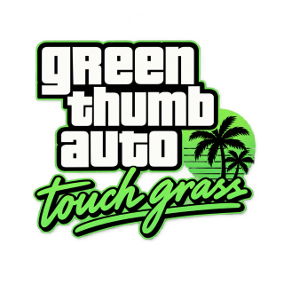
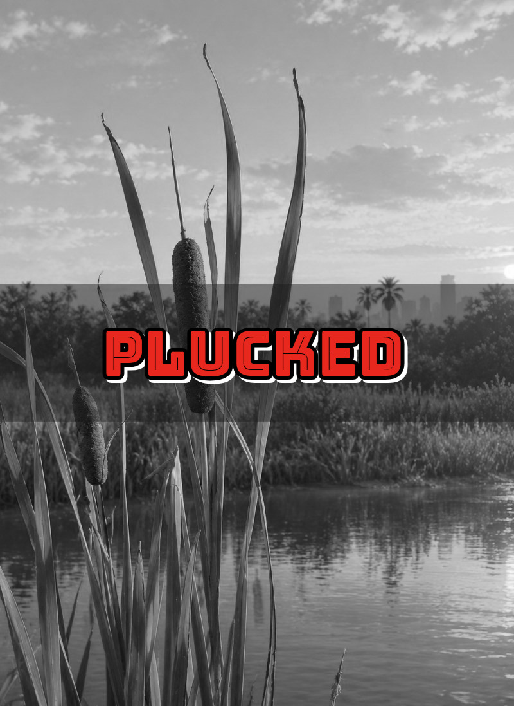
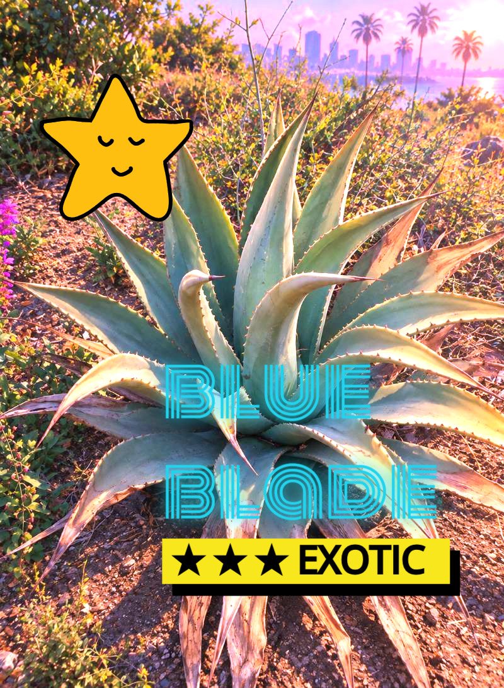
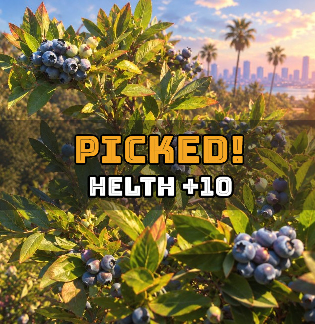

<div align="center">
  
  <h1>Green Thumb Auto: Touch Grass</h1>
</div>

A fictional GTA collectible minigame. Explore various areas, take pictures of plants, edit images with the [@unlayer/react-image-editor](https://github.com/unlayer/react-image-editor) and store in your herbarium.

# Features

## 🗺️ The Map

Start the game by selecting your start area. You can choose from 4 different nature sceneries.

## 🏜️ The Areas

While in the area, hover over the plants to see if they can be captured on a camera.

The banner in the top-left corner indicates how many plants can be collected in the current area.

When all the plants are captured, move to the neigboring area by clicking arrows on the edges.

## 📸 The Camera screen

After taking a photo, you can edit it with various filters, labels, texts and more.

Click on the "Save" button in the top-right corner to save the plant in your herbarium.

Continue taking the pohotos until you capture all the cultivars!

## 🌷 The Herbarium

Here you have 8 slots for your images. Watch your progres in the top-right corner.

Your camera edits can be downloaded to your device, for further sharing.

If you want to retake an image, click the trash icon. The removed plant will be again available out in the area - go take it!

### Examples

| Plucked                                             | Exotic                                            | Picked                                            |
| --------------------------------------------------- | ------------------------------------------------- | ------------------------------------------------- |
|  |  |  |

# Running the project

Install Next.js and packages:

```
npm install
```

Start locally:

```
npm run dev
```

# License

MIT
